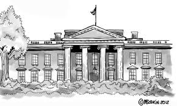
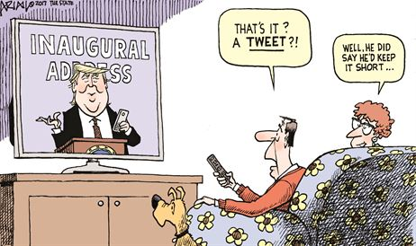
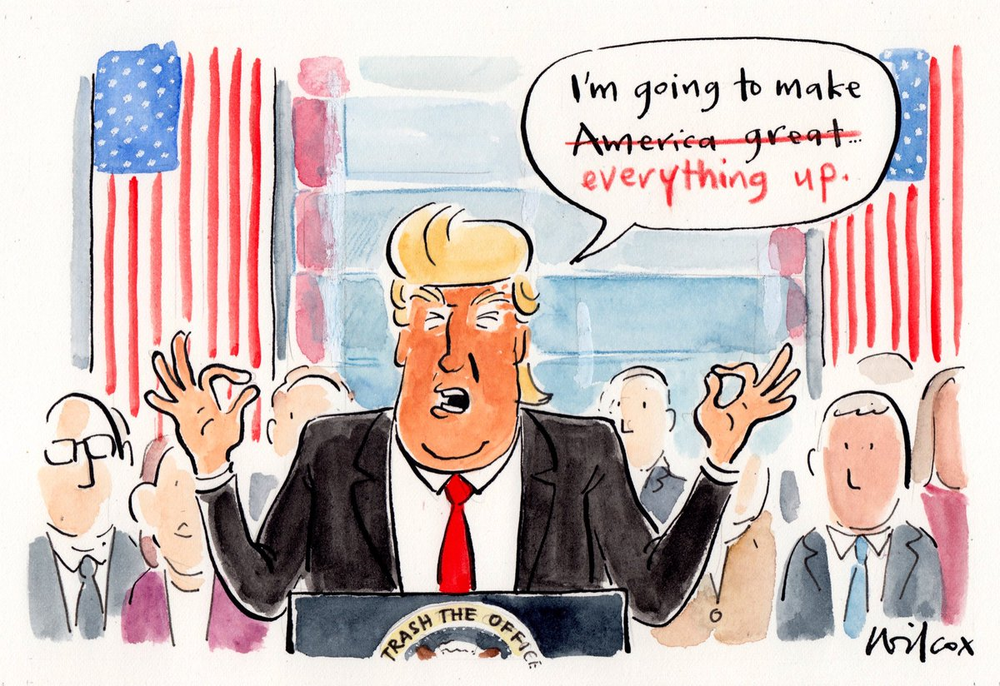

```{r, echo=FALSE, fig.align='center', message=FALSE, warning=FALSE, out.width="400px"}

```
Inauguration speech, known as the first official speech that the new US President will give to the world, shows that how the President and his team will lead the country and how this country will develop in the next four years. More or less, the inauguration speech also illustrates the character of the President and his attitude towards this special position. What these Presidents have said reflects what points has this country focused on and what problems has this country been faced. Therefore, it is interesting and meaningful to analyze the differences among these inauguration speeches.
```{r load libraries, message=FALSE, warning=FALSE, include=FALSE}
# Step 0: check and install needed packages. Load the libraries and functions. 
packages.used=c("rvest", 
                "sentimentr", "qdap","gplots", "dplyr",
                "tm", "syuzhet", "scales", "RColorBrewer",
                "RANN", "tm","DT","languageR","NLP","openNLP","magrittr","ggplot2","tidytext","wordcloud","grid","gridExtra","knitr")

# check packages that need to be installed.
packages.needed=setdiff(packages.used, 
                        intersect(installed.packages()[,1], 
                                  packages.used))
# install additional packages
if(length(packages.needed)>0){
  install.packages(packages.needed, dependencies = TRUE)
}

# load packages
library("rvest")
library("qdap")
library("sentimentr")
library("gplots")
library("dplyr")
library("tm")
library("syuzhet")
library("scales")
library("RColorBrewer")
library("RANN")
library("DT")
library("languageR")
library("NLP")
library("openNLP")
library("magrittr")
library("ggplot2")
library("tidytext")
library("wordcloud")
library("grid")
library("gridExtra")
library("knitr")


source("../lib/plotstacked.R")
source("../lib/speechFuncs.R")
```

```{r Data Harvest, message=FALSE, warning=FALSE, include=FALSE}
# Step 1: Data harvest: scrap speech URLs from <http://www.presidency.ucsb.edu/>.

#Following the example of [Jerid Francom](http://francojc.github.io/web-scraping-with-rvest/), we used [Selectorgadget](http://selectorgadget.com/) to choose the links we would like to scrap. For this project, we selected all inaugural addresses of past presidents. 
### Inauguaral speeches
main.page <- read_html(x = "http://www.presidency.ucsb.edu/inaugurals.php")
# Get link URLs
# f.speechlinks is a function for extracting links from the list of speeches. 
inaug<-f.speechlinks(main.page)
#head(inaug)
as.Date(inaug[,1], format="%B %e, %Y")
inaug<-inaug[-nrow(inaug),] # remove the last line, irrelevant due to error.

# Step 2: Using speech metadata posted on <http://www.presidency.ucsb.edu/>, we prepared CSV data sets for the speeches we will scrap. 
inaug.list<-read.csv("../data/inauglist.csv", stringsAsFactors = FALSE)

#We assemble all scrapped speeches into one list. Note here that we don't have the full text yet, only the links to full text transcripts. 

# Step 3: scrap the texts of speeches from the speech URLs.

speech.list<-inaug.list
speech.list$type<-rep("inaug", nrow(inaug.list))
speech.url<-inaug
speech.list<-cbind(speech.list, speech.url)
colnames(speech.list)[1]<-"President"
```

```{r speech.list,include=FALSE, include=FALSE}
#Based on the list of speeches, we scrap the main text part of the transcript's html page. For simple html pages of this kind,  [Selectorgadget](http://selectorgadget.com/) is very convenient for identifying the html node that `rvest` can use to scrap its content. For reproducibility, we also save our scrapped speeches into our local folder as individual speech files. 
# Loop over each row in speech.list
speech.list$fulltext<-NA
for(i in seq(nrow(speech.list))) {
  text <- read_html(speech.list$urls[i]) %>% # load the page
    html_nodes(".displaytext") %>% # isloate the text
    html_text() # get the text
  speech.list$fulltext[i]=text}
# Create the file name
#  filename <- paste0("../data/fulltext/", 
#                     speech.list$type[i],
#                     speech.list$File[i], "-", 
#                     speech.list$Term[i], ".txt")
#  sink(file = filename) %>% # open file to write 
#  cat(text)  # write the file
#  sink() # close the file
#}
```

```{r sentence.list,include=FALSE, include=FALSE}
sentence.list<-NULL
for(i in 1:nrow(speech.list)){
  sentences<-sent_detect(speech.list$fulltext[i],
                        endmarks = c("?", ".", "!", "|",";"))
  if(length(sentences)>0){
    emotions<-get_nrc_sentiment(sentences)
    word.count<-word_count(sentences)
    # colnames(emotions)=paste0("emo.", colnames(emotions))
    # in case the word counts are zeros?
    emotions=diag(1/(word.count+0.01))%*%as.matrix(emotions)
    sentence.list<-rbind(sentence.list, 
                        cbind(speech.list[i,-ncol(speech.list)],
                              sentences=as.character(sentences), 
                              word.count,
                              emotions,
                              sent.id=1:length(sentences)
                              )
    )
  }
}

sentence.list<-
  sentence.list%>%
  filter(!is.na(word.count)) 
```

### Did Trump do well in the Inauguration Speech?

```{r datatable, include=FALSE}
sentence.list.sel<-filter(sentence.list, 
                        type=="inaug", Term==1)
sentence.list.sel$File<-factor(sentence.list.sel$File)

number_of_sentences<-tapply(sentence.list.sel$sentences, sentence.list.sel$President, length)# number of sentences
average_words_per_sentence<-round(tapply(sentence.list.sel$word.count, sentence.list.sel$President, mean),0) # average words per sentence
total_words<-tapply(sentence.list.sel$word.count, sentence.list.sel$President, sum)
count<-data.frame(number_of_sentences, average_words_per_sentence, total_words)

filenames <- Sys.glob("../data/fulltext/*-1.txt")

texts <- filenames %>%
  lapply(readLines) %>%
  lapply(paste0, collapse = " ") %>%
  lapply(as.String)

names(texts) <- substr(basename(filenames),6,nchar(basename(filenames))-4)

annotate_entities <- function(doc, annotation_pipeline) {
  annotations <-  NLP::annotate(doc, annotation_pipeline)
  AnnotatedPlainTextDocument(doc, annotations)
}

itinerants_pipeline <-list(Maxent_Sent_Token_Annotator(),
                           Maxent_Word_Token_Annotator())

texts_annotated <- lapply(texts, annotate_entities, itinerants_pipeline)
#class(texts_annotated)
words<-lapply(texts_annotated, words)
#class(words)


count$vocabulary<-words%>%lapply(unique) %>%sapply(length)
count$total_words[3]<-2395;count$average_words_per_sentence[3]<-19
count$total_words[23]<-1366; count$average_words_per_sentence[23]<-24
count$total_words[28]<-2427; count$average_words_per_sentence[28]<-17
count$total_words[7]<-2459; count$average_words_per_sentence[7]<-18

colnames(count)<-c("Number of Sentences", "Average Words Per Sentence","Total Words","Total Vocabulary")

Average<-c(mean(count$`Number of Sentences`),mean(count$`Average Words Per Sentence`),mean(count$`Total Words`),mean(count$`Total Vocabulary`))
Average<-round(Average,0)
names(Average)<-colnames(count)
count<-rbind(Average,count)
rownames(count)[1]<-"average"

president.order<-c("average",rev(filter(speech.list, Term==1,type=="inaug")$President))
count1<-data.frame()
for(i in 1:40){
a<-count[rownames(count) == president.order[i],]
count1<-rbind(count1,a)
}
```


```{r, echo=FALSE}
datatable(count1, options = list(pageLength = 10))
```


From the chart above, it is obvious but not surprise to see that President Trump gave the world a simple and short inaugural speech. The number of sentences, the average words per sentence, the total words, the total vocabulary are the lowest in recent several decades. Especially for the total vocabulary, he used 579 different words in his speech, much less than the average level of the inauguration speech. 

```{r, echo=FALSE, fig.align='center', message=FALSE, warning=FALSE, out.width="400px"}

```

One of the possible reasons is that President Trump wants to show citizens a different personal style compared with those Presidents known as famous politicians. Actually, this is one of the reasons why he could get such a huge amount of supporters. From the inauguration speech, he has already started his plan making some changes in this country. Or maybe just as he said he didn't want people standing out in the cold for a long time.

To visualize how inauguration speeches changed over time, I made following four plots.

### Let's focus on how inauguration speeches have changed

```{r wordplot, message=FALSE, warning=FALSE, include=FALSE}
theme.widebar <-
  theme(text = element_text(family = "Gill Sans", color = "#444444")) +
  theme(plot.title = element_text(size = 20)) +
  theme(axis.text.x = element_text(angle = 90, hjust = 1, vjust = .4))+
  theme(axis.text.y = element_text(size=10))+
  theme(axis.title=element_text(size=12))

data1<-count1[-1,]
data1<-data1[39:1,]
data1$president<-rownames(data1)

data1$president <- factor(data1$president, levels = rev(president.order)[-40])
```

```{r, echo=FALSE, fig.align='center', fig.height=5, fig.width=11}
# Total words
p1<-data1%>%
  ggplot(aes(x = president, y = data1$`Total Words`,group=1)) +
  geom_point(color="darkred")+
  stat_summary(fun.y=sum,geom="line",color="darkred")+
  labs(title = "Total Words") +
    labs(x = "Presidents", y = "Total Words") +
  theme.widebar

# Vocabulary
p2<-data1%>%
  ggplot(aes(x = president, y = data1$`Total Vocabulary`,group=1)) +
  geom_point(color="darkred")+
  stat_summary(fun.y=sum,geom="line",color="darkred")+
  labs(title = "Total Vocabulary") +
    labs(x = "Presidents", y = "Total Vocabulary") +
    theme.widebar

grid.arrange(p1, p2, ncol = 2)
```

As time goes on, in inauguration speech, the total words and total vacabulary have not changed a lot and this value has turned to be stable in recent several decades. From the figure, we can see that in early days, it was usual that the total words of one year was much more or less than the next year or the previous year. But nowadays, this number has been stabilized to be around 2000. This is because the inauguration speech has played a more and more important role these years. Presidents use it to show his plan and power in the next few years. The best way making a speech serious and formal is to standardize the speech in terms of the length and expression. Thus, the total words have been controlled. 

```{r, echo=FALSE, fig.align='center', fig.height=5, fig.width=11}
#Number of sentences
p3<-data1%>%
  ggplot(aes(x = president, y = data1$`Number of Sentences`,group=1)) +
  geom_point(color="darkred")+
  stat_summary(fun.y=sum,geom="line",color="darkred")+
  labs(title = "Number of Sentences") +
    labs(x = "Presidents", y = "Number of Sentences") +
  theme.widebar

# Average Words Per Sentence
p4<-data1%>%
  ggplot(aes(x = president, y = data1$`Average Words Per Sentence`,group=1)) +
  geom_point(color="darkred")+
  stat_summary(fun.y=sum,geom="line",color="darkred")+
  labs(title = "Average Words Per Sentence") +
    labs(x = "Presidents", y = "Average Words Per Sentence") +
  theme.widebar
grid.arrange(p3, p4, ncol = 2)

```

However, if looking at the number of sentences and the average words per sentence, we can find that there is a uptrend for number of sentences and an obvious descend trend for the average words per sentence, which means Presidents started to shorten their sentences. That might because the pace of life turning more and more quick, people have already got used to reading short sentences posted on all kinds of social Apps rather than reading newspapers and long sentences. Indeed, shorter sentences are much more acceptable for people. As a result, Presidents started to talk to all of us by shortening their sentences.

If combining these four figures, we should notice that not the length of the speech but the pace of the speech is changing.

### What words did Presidents say?
```{r wordcloud, message=FALSE, warning=FALSE, include=FALSE, fig.align='center'}
folder.path="../data/fulltext/"
speeches=list.files(path = folder.path, pattern = "*.txt")
prez.out=substr(speeches, 6, nchar(speeches)-4)

length.speeches=rep(NA, length(speeches))
ff.all<-Corpus(DirSource(folder.path,encoding="UTF-8"))

ff.all<-tm_map(ff.all, stripWhitespace)
ff.all<-tm_map(ff.all, content_transformer(tolower))
ff.all<-tm_map(ff.all, removeWords, stopwords("english"))
ff.all<-tm_map(ff.all, removeWords, character(0))
ff.all<-tm_map(ff.all, removePunctuation)

dtm <- DocumentTermMatrix(ff.all,
                          control = list(weighting =
                                           function(x)
                                             weightTfIdf(x, normalize =
                                                           FALSE),
                                         stopwords = TRUE))
ff.dtm=tidy(dtm)
```

```{r, echo=FALSE, fig.height=7, fig.width=7, message=FALSE, warning=FALSE,fig.align='center'}
par(mfrow=c(2,2))
# Donald Trump
wordcloud(ff.dtm$term[ff.dtm$document==speeches[9]],
          ff.dtm$count[ff.dtm$document==speeches[9]],
          scale=c(3,0.5),
          max.words=200,
          min.freq=1,
          random.order=FALSE,
          rot.per=0.1,
          use.r.layout=FALSE,
          random.color=FALSE,
          colors=brewer.pal(10,"Reds"), 
          main=prez.out[8])
#Barack Obama
wordcloud(ff.dtm$term[ff.dtm$document==speeches[6]],
          ff.dtm$count[ff.dtm$document==speeches[6]],
          scale=c(3,0.5),
          max.words=200,
          min.freq=1,
          random.order=FALSE,
          rot.per=0.1,
          use.r.layout=FALSE,
          random.color=FALSE,
          colors=brewer.pal(10,"Reds"), 
          main=prez.out[6])
#George W Bush
wordcloud(ff.dtm$term[ff.dtm$document==speeches[19]],
          ff.dtm$count[ff.dtm$document==speeches[19]],
          scale=c(3,0.5),
          max.words=200,
          min.freq=1,
          random.order=FALSE,
          rot.per=0.1,
          use.r.layout=FALSE,
          random.color=FALSE,
          colors=brewer.pal(10,"Reds"), 
          main=prez.out[19])
#WilliamJClinton
wordcloud(ff.dtm$term[ff.dtm$document==speeches[52]],
          ff.dtm$count[ff.dtm$document==speeches[52]],
          scale=c(3,0.5),
          max.words=200,
          min.freq=1,
          random.order=FALSE,
          rot.per=0.1,
          use.r.layout=FALSE,
          random.color=FALSE,
          colors=brewer.pal(10,"Reds"), 
          main=prez.out[52])
```

The word cloud technology shows us what does a President say much during the speech. First, President Clinton, who won the competition against George Bush. As a young politician at that time, he focused on economic revolution. So in his inauguration speech, we can see words like renewal, today, raise, and so on. 

As for President George W Bush, just like his father, he focused more on safety problems inside and outside the country. During his term of office, US army invaded Iraq and Afghan. In his inauguration speech, we see tyranny, fire, defend, etc. 

President Obama, the only President whose word cloud does not contain the word America. He is known as a person who is really good at speech. In his word cloud, we see journey, creed, technology. He focused on the revolution and he launched a series of new policies during his terms of office. He said in the inauguration speech: Our Journey is not complete. 

Finally, President Trump had been focusing on solving the employment problem and protecting domestic workers before he won the presidential election. So during his inauguration speech, we see words like jobs, dreams, everyone factories, protected, etc.

What's more, I find that three of recent four presidents loved to say "America" in their inauguration speech, especially President Trump, he hit the world for 35 times. So I made a plot to see if there is any trend. 


### Count the number of "America" in inauguration speeches
```{r, echo=FALSE, fig.height=4.5, fig.width=7,fig.align='center'}
count_america<-lapply(words, function(x){length(grep("America", x))})
names(count_america)<-rownames(count)[-1]

rev.president.order<-rev(president.order[-1])

count.america<-c()
for(i in 1:39){
a<-count_america[names(count_america) == rev.president.order[i]]
count.america<-c(count.america,a)
}

america<-data.frame(name=names(count.america), count=as.integer(count.america))
america$name <- factor(america$name, rev.president.order)

#Number of America
  ggplot(america,aes(x = name, y = count, group=1)) +
  geom_point(color="darkred")+
  stat_summary(fun.y=sum,geom="line",color="darkred")+
  labs(x = "Presidents", y = "Number of America") +
  theme.widebar

```

From the figure above, beginning from President Warren G. Harding who was the president of the post World War period, the number of the word America has increased in a high speed. The word "America" is a good way to stimulate people's patriotism during the inauguration speech, also a good way to win people's hearts.

### Sentiment Analysis of Inauguration speeches
```{r sentiment, include=FALSE}
f.plotsent.len=function(In.list, InFile, InType, InTerm, President){
  
  col.use <- c("blue", "red")
  
  In.list$topemotion=apply(select(In.list, 
                                  negative:positive), 
                                  1, which.max)
  In.list$topemotion.v=apply(select(In.list,
                                    negative:positive), 
                                    1, max)
  
  temp <- In.list$topemotion.v
  In.list$topemotion.v[In.list$topemotion==1] <- -temp
  #In.list$topemotion.v[abs(In.list$topemotion.v)<0.05]=0
  
  df <- In.list%>%filter(File==InFile, 
                         type==InType, Term==InTerm)%>%
    select(sent.id, topemotion, topemotion.v)

  dct_values <- get_transformed_values(
    df$topemotion.v, 
    low_pass_size = 5, 
    x_reverse_len = 100,
    scale_vals = F,
    scale_range = T
    )
  dct_signs <- 0.5*sign(dct_values)+1.5
  ptcol.use <- col.use[dct_signs]
  plot(dct_values, 
       col=ptcol.use,
       lwd="2",
       type="h",
       main=President, ylab = "level", xlab = "Transcript from begining to the end")
  abline(h=0,lwd="2")
}
```

Finally, in the sentiment analysis part, whether the sentiment was positive or negative during the whole speech process has been showed in the following figures. Red parts mean positive and blue parts mean negative.

```{r, echo=FALSE, fig.height=5, fig.width=10, message=FALSE, warning=FALSE}
par(mfrow=c(1,2))
f.plotsent.len(In.list=sentence.list, InFile="DonaldJTrump", 
               InType="inaug", InTerm=1, President="Donald J. Trump")

f.plotsent.len(In.list=sentence.list, InFile="BarackObama", 
               InType="inaug", InTerm=1, President="Barack Obama")
```

From the plot, both President Trump and Obama has positive and negative emotion during their speeches, but President Trump's speech has more negative emotion, which known as unusually dark. He said: "For too long, a small group in our nation's capital has reaped the rewards of government while the people have borne the cost". But fortunately, he ended with positive altitude:"We will make America strong again. We will make America wealthy again. We will make America proud again." From the figure, at the end of his speech, the positive emotion went to the highest point. 
```{r, echo=FALSE, fig.align='center', message=FALSE, warning=FALSE, out.width="400px"}

```

As for President Bush and President Clinton, since at that time, America was confronted with some serious problems such as economic problems and country safety problems, the inauguration speeches were a little bit negative. From the sentiment analysis, we can see clearly that the blue parts are bigger than the red parts. And the negative emotion appeared at the end of the speech, which means at that time, even the President did not hold a positive attitude towards the future of the country.

```{r, echo=FALSE, fig.height=5, fig.width=10, message=FALSE, warning=FALSE}
par(mfrow=c(1,2))
f.plotsent.len(In.list=sentence.list, InFile="GeorgeWBush", 
               InType="inaug", InTerm=1, President="George W. Bush")

f.plotsent.len(In.list=sentence.list, InFile="WilliamJClinton", 
               InType="inaug", InTerm=1, President="William J. Clinton")

```

To sum up, the sentiment analysis can somehow demonstrates the President's attitude towards the future of this country.


